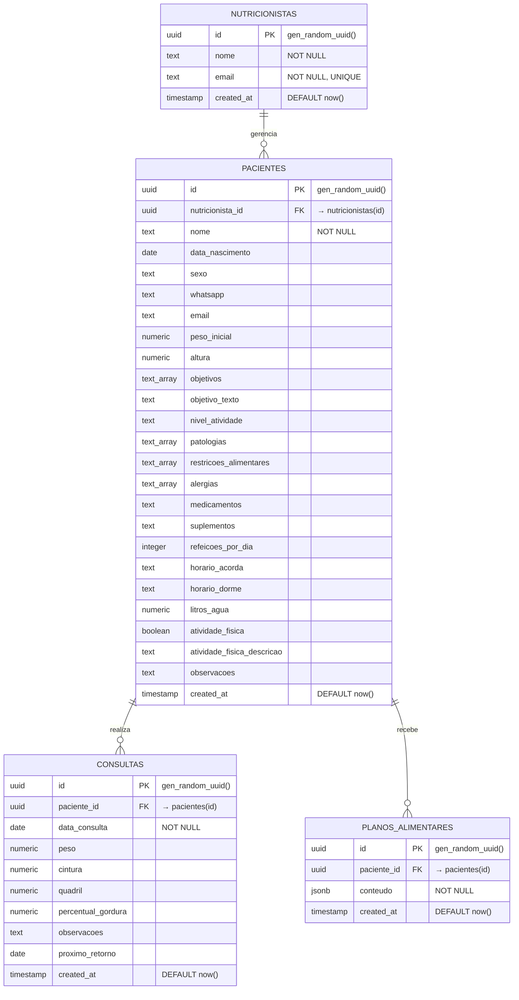

# 🥗 Ale Nutri — Sistema de Gestão Inteligente para Nutricionistas

<div align="center">


**Plataforma moderna, segura e responsiva para nutricionistas gerenciarem pacientes, consultas, planos alimentares e métricas de saúde.**

[🌐 Acessar Demonstração Online](https://ale-nutri.vercel.app)

</div>

---

## 📋 Sumário

- [Visão Geral](#-visão-geral)
- [Funcionalidades](#-funcionalidades)
- [Tecnologias Utilizadas](#-tecnologias-utilizadas)
- [Estrutura do Banco de Dados (Neon)](#-estrutura-do-banco-de-dados-neon)
- [Segurança & Autenticação](#-segurança--autenticação)
- [Como Executar Localmente](#-como-executar-localmente)
- [Variáveis de Ambiente](#-variáveis-de-ambiente)
- [Deploy em Produção (Vercel)](#-deploy-em-produção-vercel)
- [Estrutura do Projeto](#-estrutura-do-projeto)
- [Licença](#-licença)

---

## 🌟 Visão Geral

O **Ale Nutri** foi desenvolvido para simplificar e profissionalizar o dia a dia da clínica nutricional. Com uma interface elegante e moderna baseada na paleta *Emerald Green & Teal*, o sistema oferece rapidez, segurança de dados e persistência na nuvem via **Neon Serverless PostgreSQL**.

---

## 🚀 Funcionalidades

- **Autenticação Segura**:
  - Cadastro de nutricionistas com validações completas (e-mail profissional, senha mínima de 8 caracteres e confirmação).
  - Login integrado com **Neon Auth / Better Auth**.
  - Persistência de sessão local (`localStorage`) para login contínuo.
  - Mensagens de erro amigáveis em português e feedback visual de carregamento.
- **Painel de Controle (Dashboard)**:
  - Boas-vindas personalizadas ao profissional conectado.
  - Acesso rápido aos módulos de **Pacientes**, **Consultas**, **Planos Alimentares** e **Métricas**.
  - Função de logout com encerramento de sessão seguro.
- **Integração em Tempo Real com Neon**:
  - Sincronização automática entre as contas de autenticação e a tabela relacional de nutricionistas.
  - Consultas SQL otimizadas através do driver `@neondatabase/serverless`.

---

## 🛠 Tecnologias Utilizadas

- **Frontend**: [React 18](https://react.dev/) + [Vite](https://vitejs.dev/)
- **Estilização**: CSS Vanilla com Design System moderno (Glassmorphism, Tokens HSL, Gradientes e Microinterações)
- **Ícones**: [Lucide React](https://lucide.dev/)
- **Banco de Dados**: [Neon PostgreSQL Serverless](https://neon.tech/)
- **Autenticação**: [Better Auth](https://better-auth.com/) / [Neon Auth](https://neon.tech/docs/guides/neon-auth)
- **Deploy & Hospedagem**: [Vercel](https://vercel.com/)

---

## 🗄 Estrutura do Banco de Dados (Neon)

O banco de dados relacional foi modelado para suportar todo o fluxo de acompanhamento nutricional:



---

## 🔒 Segurança & Autenticação

1. **Row Level Security (RLS)**: Políticas ativadas no PostgreSQL garantem isolamento de dados por nutricionista.
2. **Neon Auth Trusted Origins**: O domínio de produção (`https://ale-nutri.vercel.app`) e o ambiente local (`localhost`) estão autorizados contra ataques de CSRF e acessos de origens não confiáveis.
3. **Sem segredos expostos**: As credenciais e variáveis sensíveis são configuradas estritamente via variáveis de ambiente protegidas no Vercel.

---

## 💻 Como Executar Localmente

### Pré-requisitos
- [Node.js](https://nodejs.org/) (versão 18 ou superior)
- [Git](https://git-scm.com/)

### Passo a Passo

1. **Clone o repositório:**
   ```bash
   git clone https://github.com/alessandraspbr/ale-nutri.git
   cd ale-nutri
   ```

2. **Instale as dependências:**
   ```bash
   npm install
   ```

3. **Configure as variáveis de ambiente:**
   Copie o arquivo `.env.example` para `.env` e preencha com as URLs do seu projeto Neon:
   ```bash
   cp .env.example .env
   ```

4. **Inicie o servidor de desenvolvimento:**
   ```bash
   npm run dev
   ```

5. **Acesse no navegador:**
   - URL: `http://localhost:3000` (ou a porta informada no terminal)

6. **Gerar build de produção:**
   ```bash
   npm run build
   ```

---

## 🔑 Variáveis de Ambiente

Crie um arquivo `.env` na raiz do projeto com as seguintes chaves:

```env
# URL base do Neon Auth
VITE_NEON_AUTH_URL=https://<seu-endpoint>.neonauth.<regiao>.aws.neon.tech/neondb/auth

# String de conexão do Neon Serverless PostgreSQL (pooler)
VITE_DATABASE_URL=postgresql://<usuario>:<senha>@<host-pooler>.neon.tech/neondb?sslmode=require
```

---

## ☁️ Deploy em Produção (Vercel)

1. Faça o fork ou importe este repositório no [Vercel](https://vercel.com).
2. Adicione as variáveis de ambiente (`VITE_NEON_AUTH_URL` e `VITE_DATABASE_URL`) nas configurações do projeto na Vercel (**Settings > Environment Variables**).
3. Certifique-se de que a URL do Vercel (ex: `https://ale-nutri.vercel.app`) está adicionada na lista de **Trusted Origins** do Neon Auth.
4. Clique em **Deploy**. O deploy será realizado e atualizado automaticamente a cada novo commit na branch `main`.

---

## 📂 Estrutura do Projeto

```
ale-nutri/
├── _prompts/                 # Documentação de requisitos e engenharia de prompts
├── public/                   # Arquivos públicos estáticos
├── src/
│   ├── components/           # Componentes React
│   │   ├── Dashboard.jsx     # Painel principal do nutricionista
│   │   ├── HeaderLogo.jsx    # Cabeçalho com logo estilizada
│   │   ├── LoginForm.jsx     # Formulário de login
│   │   └── RegisterForm.jsx  # Formulário de cadastro de usuário
│   ├── lib/                  # Utilitários de autenticação e banco de dados
│   │   ├── auth.js           # Cliente Better Auth e gestão de sessão local
│   │   └── db.js             # Conexão Neon Serverless SQL e sync de dados
│   ├── App.jsx               # Roteamento de estados e controle de autenticação
│   ├── index.css             # Sistema de design tokens e estilos globais
│   └── main.jsx              # Ponto de entrada da aplicação
├── .env.example              # Modelo de variáveis de ambiente
├── package.json              # Metadados e dependências do projeto
├── vite.config.js            # Configuração do bundler Vite
└── README.md                 # Documentação completa do projeto
```

---

## 📄 Licença

Distribuído sob a licença MIT. Consulte `LICENSE` para obter mais informações.

<div align="center">
Desenvolvido com 💚 por Alessandra Barbosa Lopes
</div>
